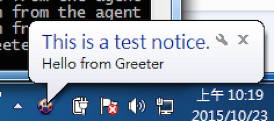
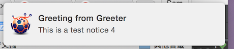

EAvatar ME
##########

.. image:: https://coveralls.io/repos/eavatar/eavatar-me/badge.svg?branch=develop&service=github
  :target: https://coveralls.io/github/eavatar/eavatar-me?branch=develop

EAvatar ME, or Avame for short, is an event-driven agent for task automation.
It's designed with following scenarios in mind:

* Web scraping
* Web functional tests
* Network service monitoring
* Cloud application integration

Basically speaking, Avame runs tasks on behalf of the user in the background.
Last but not least, it acts as your intelligent notifier, see the screenshots.

Screenshots
===========

For Windows
^^^^^^^^^^^

System tray notification is used.

For OS X
^^^^^^^^

Avame supports the notification center.

For Ubuntu
^^^^^^^^^^

Documentation
=============

http://docs.eavatar.me

License
=======

Apache license 2.0