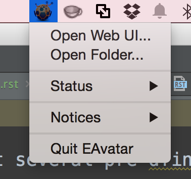
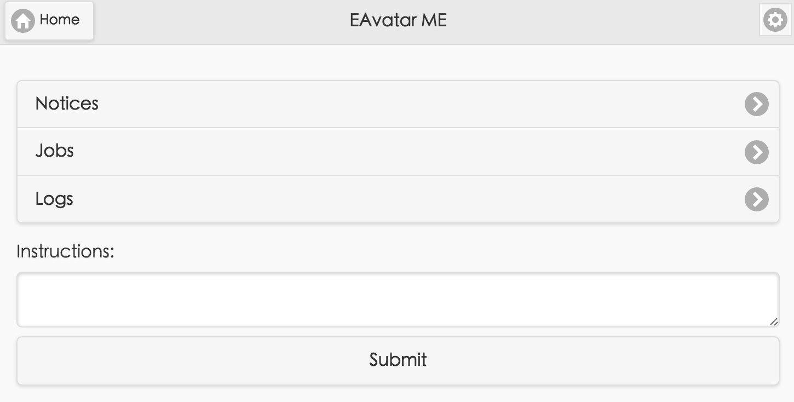
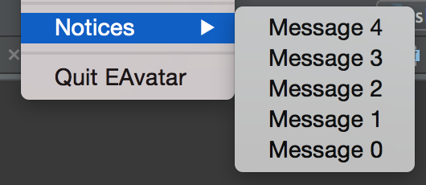
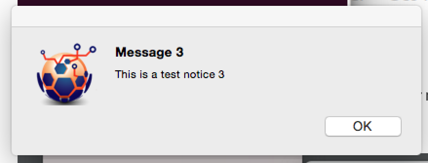
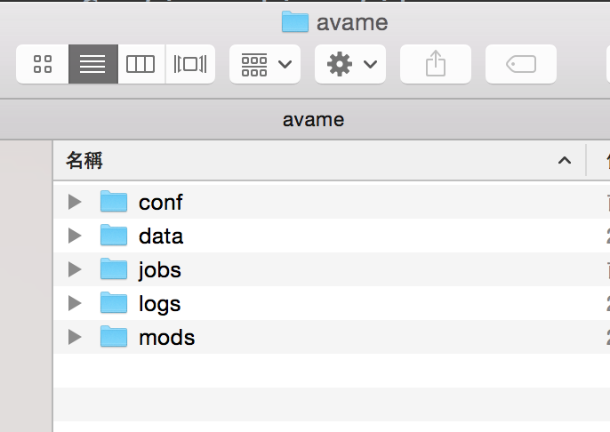

User Guide
==========

**Avame not yet released, the document is for your information only.**

System Requirements
-------------------

Supported Environments
^^^^^^^^^^^^^^^^^^^^^^

Avame is a cross-platform application which supports following desktop environments:

1. Windows 7 or above (X86-64 architecture)

2. OS X 10.8+ (X86-64 architecture)

3. Ubuntu 14.04+ Unity desktop (X86-64 architecture)

Web Browsers
^^^^^^^^^^^^

Avame uses your default web browser to access the web user interface (a.k.a. webfront).

* Google Chrome 46.0+
* Firefox 41.0+
* Internet Explorer 11

Installation
------------

For desktop environments, such as Windows, OS X, etc, Avame is distributed as a portable
application. Following are the usual steps to install Avame for these environments:

1. Download the distribution package for your environment.
    The package might be in different formats for various environments.

    * avame-x.y.x.zip for Windows
    * avame-x.y.z.tgz for Ubuntu
    * avame-x.y.z.dmg for OS X

    , where 'x.y.z' is the release version.

2. Uncompress the package to a suitable directory.
    Use the existing tool to uncompress the distribution package.

3. Delete the downloaded distribution package.
    This step is optional.

OS X
^^^^

Avame is released as an application bundle within a disk image (.dmg). Follow the steps
to install Avame on OS X:

1. Double click the disk image to mount it.
2. All you have to do is copy the application bundle to your Applications folder.
3. Unmount the disk image.

Launch the Application
----------------------

Assume APPFOLDER is the installation folder of Avame application.
You may launch Avame via command line or File manager or the like.

Windows
^^^^^^^

Launch the application from command line.

.. code-block:: bash

    APPFOLDER\avame.exe

OS X
^^^^

Launch from the console

.. code-block:: bash

    APPFOLDER/avame

or run the app bundle:

.. code-block:: bash
    ope n APPFOLDER/EAvatar.app

Ubuntu
^^^^^^

Launch from the console

.. code-block:: bash

    APPFOLDER/avame

Application System Tray
-----------------------

As an agent, Avame works silently most of the time.
The main UI is a system tray icon on the desktop environment of your choice.
Through the tray icon, you may trigger a context menu illustrated as follow:

Open Web UI (Not working yet)
-----------------------------

From the context menu, choose the 'Open Web UI...' option or
input 'http://127.0.0.1:5080/' in your browser's address bar.
Following figure illustrates the home page of the web UI (Fake):

Get Notified
------------

Avame may notify you from time to time. The way how it notifies is platform-specific, though.

For Windows
^^^^^^^^^^^

System tray notification is used.

.. image:: _static/win7-notice.png
    :alt: Avame notification on Windows 7
    :width: 480

For OS X
^^^^^^^^

Avame supports the notification center.

.. image:: _static/osx-notice.png
    :alt: Avame notification on OS X
    :width: 480

For Ubuntu
^^^^^^^^^^

.. image:: _static/ubuntu-notice.png
    :alt: Avame notification on Ubuntu
    :width: 480

Recent Notices
--------------

In case that you missed some notifications from Avame, fear not. 10 most recent notices
are kept in the context menu for your convenience:

Choose the notice you want to read, a message box should show up:

Application Folder
------------------

Location
^^^^^^^^

Avame creates a per-user application folder when runs for the first time.
The location is dependent on the operating system, following are the typical paths:

* Mac OS X:
    ~/Library/Application Support/avame
* Mac OS X (POSIX):
    ~/.avame
* Ubuntu:
    ~/.config/avame
* Win 7 (roaming):
    C:\\Users\\<user>\\AppData\\Roaming\\avame
* Win 7 (not roaming):
    C:\\Users\\<user>\\AppData\\Local\\avame

Structure
^^^^^^^^^

Under the application folder, there exist several pre-defined subfolders.
Users may create more for other purposes.

1. conf/
    Configuration files.

2. data/
    Folder for storing generic data.

3. jobs/
    Auto-start jobs.

4. logs/
    Log files.

5. mods/
    Standalone module files. Modules in this folder will be imported when start.

6. pkgs/
    Python package distributions in EGG format, some of them may also be Avame's extensions.

Open Folder
^^^^^^^^^^^

From the context menu, choose the 'Open Folder...' option to open Avame application folder.

